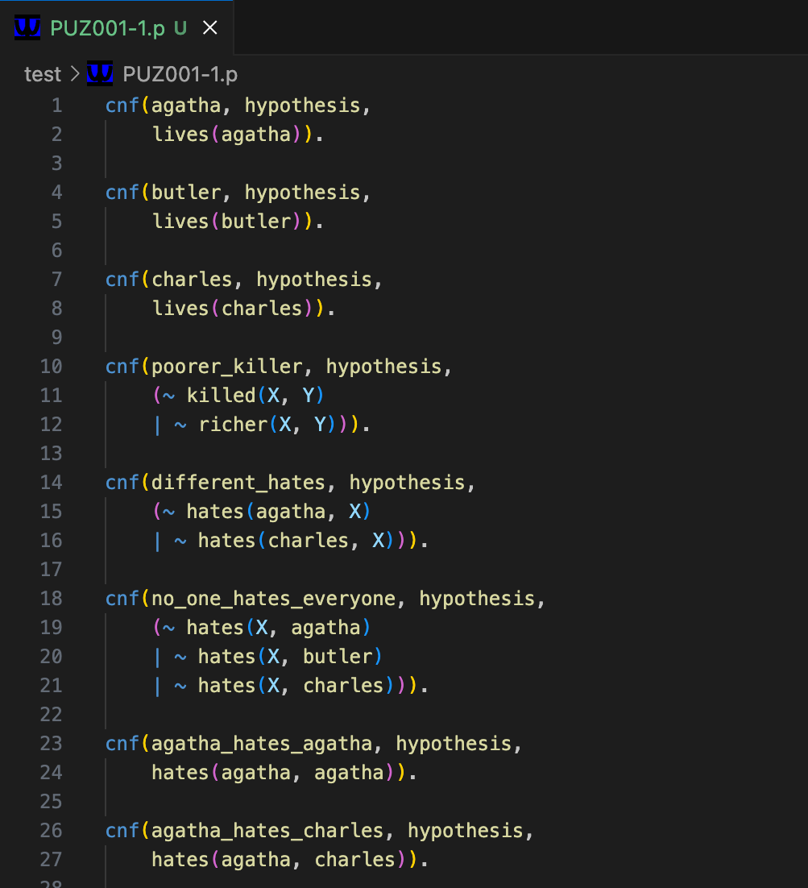

# TPTP Editor

TPTP Editor is a Visual Studio Code extension that provides a streamlined development environment for working with the TPTP language — a standard format used extensively in automated theorem proving and formal logic research. 

Built by Daniel Li in collaboration with Dr. Geoff Sutcliffe, the creator of the TPTP library, the extension features full syntax highlighting for both CNF, FOF, THF, etc. formats, enabling clear visual structuring of axioms, hypotheses, and conjectures. It recognizes '.p' & '.s' problem files, supports pretty-printing and safe character escaping, and integrates directly with the SystemOnTPTP + SystemOnTSTP service, allowing users to author, submit, and view solver results without leaving the editor. 

Designed for researchers, students, and logic developers. TPTP Editor enhances productivity and readability in formal logic workflows within the comfort of VS Code.

## Features

- Syntax highlighting for `.p` and `.s` files
- Support for:
  - Single-line `%` comments
  - Block comments `/* ... */`
  - Quoted strings
  - Logical operators and quantifiers
  - `$`-prefixed system constants
  - TPTP directives like `fof`, `cnf`, `thf`, etc.
  - Various special characters (`~`, `|`, `&`, etc.)
- Clean and consistent token coloring across themes
- Real-time error diagnostics and checking
- Automatically parses and extracts content for submission to theorem provers
- Pretty-prints TPTP problem content inside the webview for readability
- Custom file icons for '.p' & '.s' files inside VS Code

## Requirements

No dependencies required — just install and start editing `.p` or `.s` files.

## Extension Settings

This extension does not contribute any custom settings.

## Release Notes

### 0.0.1

Initial release with base syntax support for TPTP problem files.

### 0.0.2

Updated logo and extension image. Changed README.

### 0.0.3

Added Change Log. Removed Known Issues.

### 0.0.4

Implemented Multiline reading. Added file icon.

### 0.0.5

Added pretty-printing. Fixed newline issue.

### 0.0.6

Implemented problem prover inside editor context menu. 

### 0.0.7

Added continute to option for TPTP Format and IDV Image

---

## For TPTP Language

The Thousands of Problems for Theorem Provers (TPTP) World is the established infrastructure used by the Automated Theorem Proving (ATP) community for research, development, and deployment of ATP systems.
The TPTP format is widely used in logic and automated reasoning. Learn more at [http://www.tptp.org](http://www.tptp.org)

---

## Development Notes

- Grammar implemented via a `tmLanguage.json` file
- Uses TextMate scopes compatible with popular VS Code themes
- Lexer/grammar derived from an existing [BNF TPTP grammar](https://tptp.org/UserDocs/TPTPLanguage/SyntaxBNF.html)
- Actively tested against a large sample of problems from the official TPTP problem library
- Webview-based prover runner panel implemented with custom form UI to prove theorems

---

**Enjoy using TPTP Editor!**
